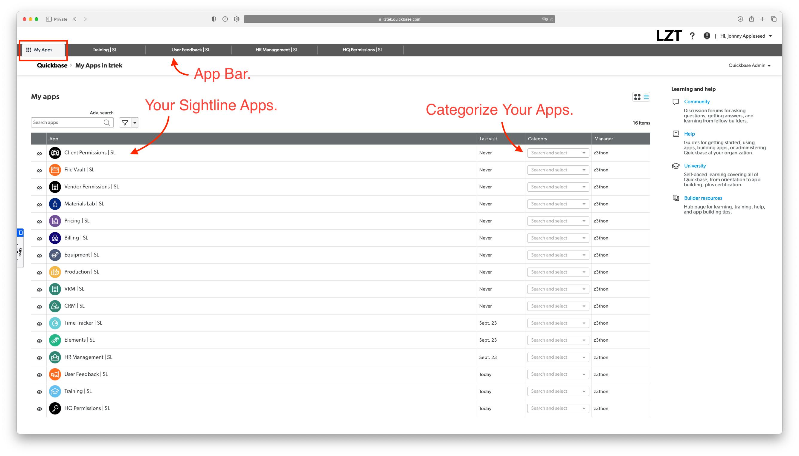

# 1 Navigating in Sightline.
### There are five core tools we use to navigate within Sightline:
1. Apps
2. Dashboards
3. Tables
4. Reports
5. Forms/Records

In this guide we will review each one with images and give explanations of each concept.

## 1. Apps
Sightline uses "Apps" that allow you to separate core features and functions from one another. The Sightline App Suite consists of 22 unique and different apps. Each time our team encounters a new manufacturing industry a new app will be made for that industry.

Here is a list of the apps in our current app suite:

1. HQ Permissions
2. Client Permissions
3. Vendor Permissions
4. HR Manager
5. CRM
6. VRM
7. Time Tracker
8. Billing
9. File Vault
10. Training
11. Elements
12. Pricing
13. Logistics
14. Equipment
15. Materials Lab
16. Production
17. Purchase Orders
18. ERP
19. User Feedback

Industry Specific Apps:

20. Cut & Sew
21. IT & Backend
22. Propertii
 
(List updated on 2022/12/02)

