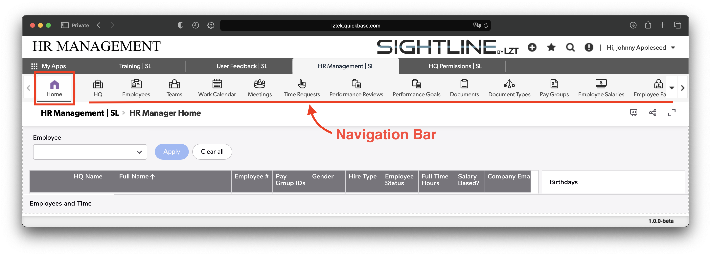
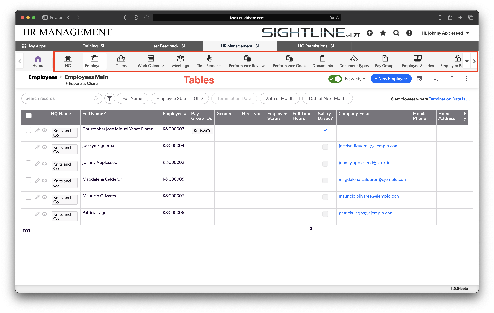
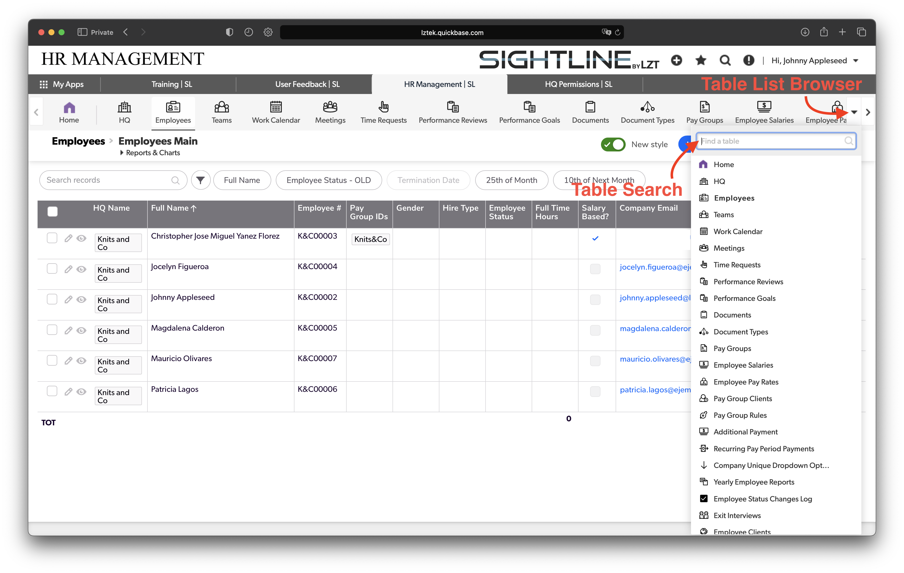

# 2 Navigation in Sightline
### There are five core tools we use to navigate within Sightline:
1. Apps
2. Dashboards
3. Tables
4. Reports
5. Forms/Records

In this guide we will review each one with images and give explanations of each concept.

## 1. Apps
You can navigate between apps by going to the "My Apps" tab. Each time you open an app it will open a new App Tab and store it in the top row.

You can categorize your apps if you'd like and filter based on the category.

## 2. Dashboards
Each app has a Dashboard/Home Page. Dashboards can be different depending on their purpose and guides for navigating the dashboard(s) within each app can be found in the "Plans" section.

You can navigate to the Dashboard/Home Page by clicking on the "Home" button on the left side of the navigation bar.

## 3. Tables
Tables are similar to a single tab in an excel spreadsheet. You can navigate to the different tables by selecting each table from the Navigation Bar. Each table displays a default report when you arrive.

You can also click the drop-down on the right-hand side and search for a specific table.

## 4. Reports
Each Table may have more than one report. Reports are unique ways to browse the information in each table. Reports may filters tables in different ways or leave out different fields. Some have specific uses, or are designed for exporting.

If you ever need a new report made reach out to us on our [Discord Community](https://discord.gg/zNCZnKNXEv)!

Once you have navigated to the report you want there are different ways to edit/interact with the data on the report. Reports allow you to Grid edit the information, filter the information, downloadload a CSV of the report, save a link to the report and more.

## 5. Forms/Records
Each Table has a button that allows you to add a single record to the table. It will be formatted as: "+ New \<Table Name>"

To view a single record you can click the eye next to it on the left. To edit, the pencil.

Each row of a report on a table is a single record. When you create a single new record you will be redirected to a form that will prompt you to fill out the information. Each form represents a single record and each form is different because the data being collected/stored is different.

