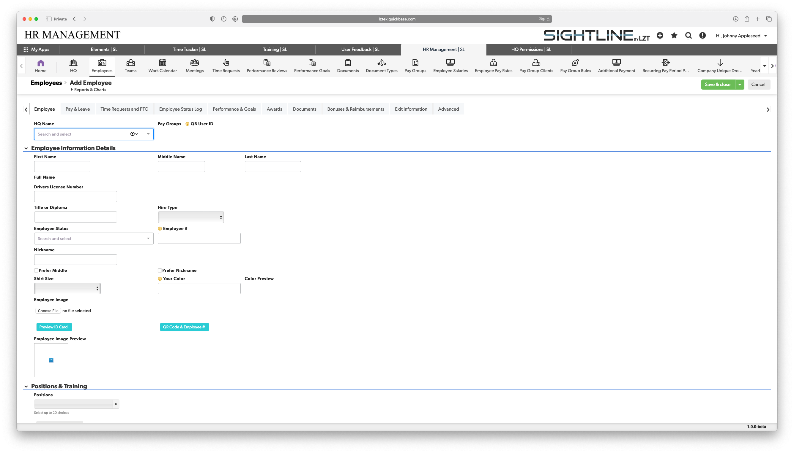

# Apps & Tables

Each row on a report/table represents a single record. When you create a new record you will be redirected to a form that will prompt you to fill out the required information for that record. Each form represents a single record and because each table stores different information each form is also different. In the two forms below one is for adding a new employee to your company and the other is for adding a new Part to the Elements App.

