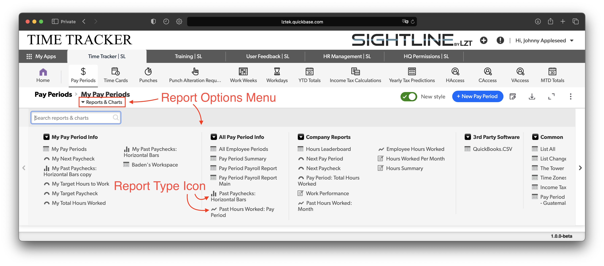

# Reports and Exporting
Tables have lots of cool hidden super powers. Two of the most powerful are Reports and Exporting your reports as CSVs.

## Reports
Each Table can contain multiple reports. Each report has the data formatted in a specific way, or may also be a chart, like a pie chart or bar graph. Often the information on each report is for different purposes.

Each report has a use case that has been thought out by the team and the partners we are working with, but if you need a new report with the data formatted differently that doesn't currently exist reach out to us on our [Discord Community](https://discord.gg/zNCZnKNXEv).

We will do our best to keep updating reports as frequently as possible to keep them relevant and useful.

To view other reports use the "Reports & Charts" drop-down and select the report you would like to view as shown in Navigation.

## Exporting
When you need to manipulate the data beyond what is possible naitively in Sightline or you need to send the data to someone outside of the Sightline system you can download the report you are looking at as a CSV. Keep in mind if there are buttons on the form you are exporting, those buttons will show up at hyperlinks in the CSV once you open it. Many of our reports are designed to be exported and do not contain buttons specifically for this reason.

As mentioned above in the reports section if there is a specific report you need so that you can frequently export it as a CSV and use it for other purposes please reach out to us and let us know what you need.