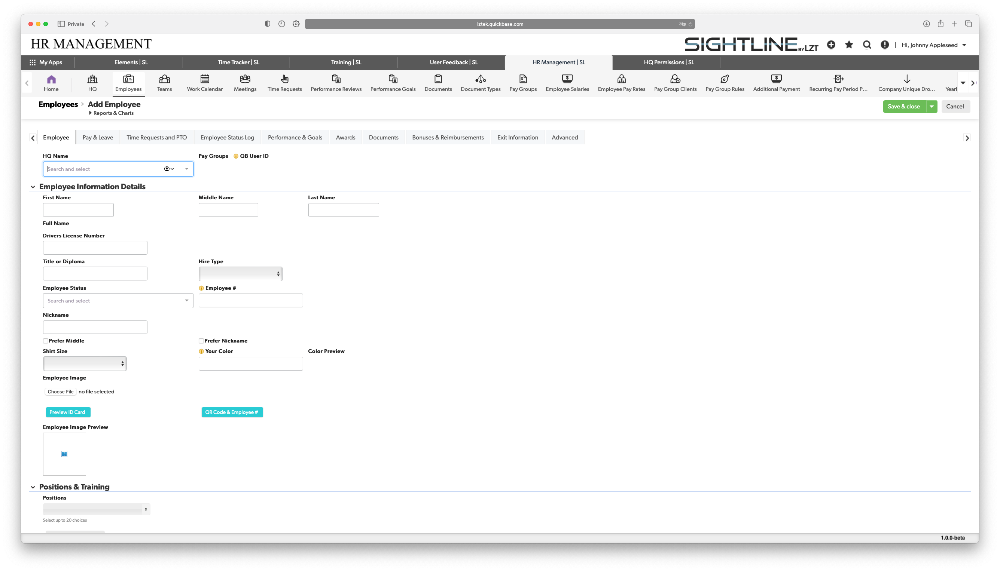
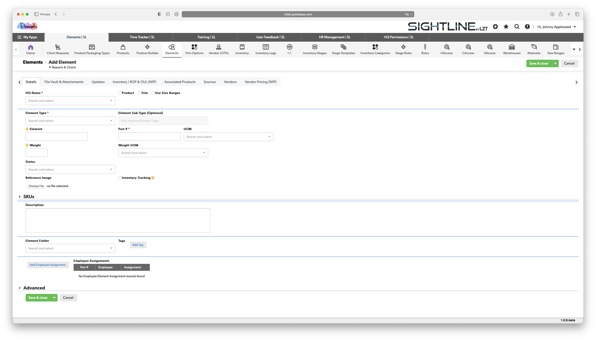

# Forms and Records

Forms and Records are how you view, edit, and save your data in Sightline.

### Viewing Forms

When you want to view a form, click on the "eye" 👁️ icon next to the record you would like to view.

### Editing Forms

When you want to edit a form, click on the "pencil" ✏️ icon next to the record you would like to view.

### Saving Forms

In the two forms below one is for adding a new employee to your company and the other is for adding a new Part to the Elements App.

