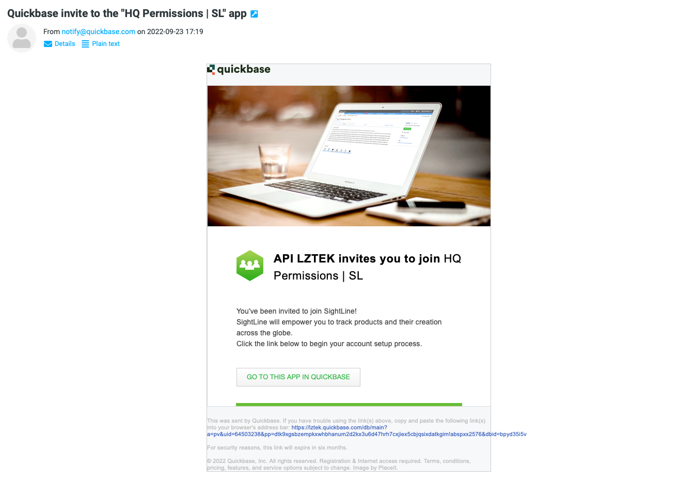

# Creando tu cuenta
### 1. Inscripción de Sightline.

   Luego de inscribirse en Sightline, un miembro de nuestro equipo habilitará tu cuenta de administrador y te concederá acceso a tu nueva cuenta de la empresa.

### 2. Sigue las instrucciones en tu correo para crear la cuenta.

   Recibirás un correo electrónico a la cuenta que deseas que sea administradora de Sightline. Un ejemplo del correo electrónico que recibirías sería el siguiente:

  

### 3. Datos de la inscripción.

   Cuando te inscribes debes brindar un nombre y contraseña para tu cuenta. Marcar la casilla de aceptación de términos de servicio de Quickbase y confirma la creación de tu cuenta.

### 4. Listo!

   Tu cuenta ha sido creada y ahora tienes acceso a Sightline. Para regresar a Sightline favor marcar la siguiente página web: [https://lztek.quickbase.com](https://lztek.quickbase.com)

Futuros usuarios que invites a Sightline pasarán por el mismo proceso de creación de cuenta cuando los agregues desde la app HQ Permission.

---

En caso de cualquier consulta o temas que desees que agreguemos a nuestra guía de usuario por favor contactarnos a través de nuestra [Discord Community](https://discord.gg/zNCZnKNXEv)!

Muchas gracias!