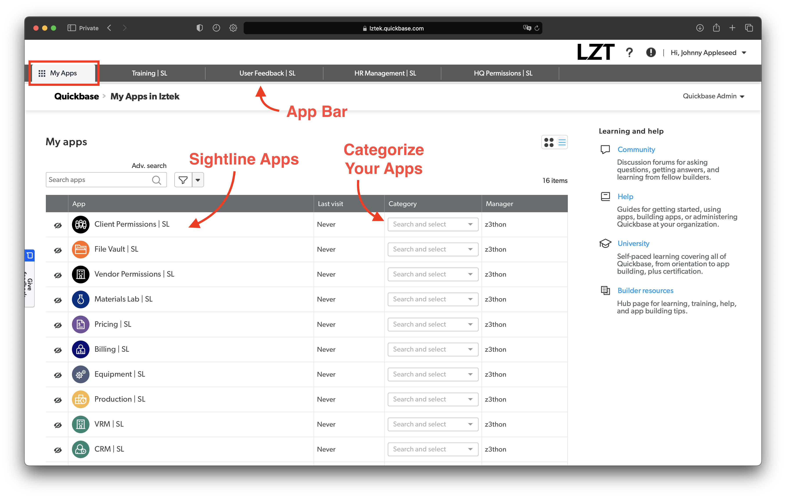

# Navegar en Sightline
### Existen 5 herramientas esenciales que utilizamos para navegar dentro de Sighltine:
1. Aplicaciones (Apps)
2. Tableros (Dashboards)
3. Tablas
4. Reportes
5. Formularios/Registros (Forms/Records)

En esta guía revisaremos cada una con imágenes y explicaremos cada concepto.

## 1. Aplicaciones (Apps)
Se puede navegar entre aplicaciones desde la pestaña "My Apps". Cada vez que abras una aplicación se creará y guardará una nueva pestaña en la Barra de Aplicaciones para facilitar el acceso en el futuro.

Existe la opción de categorizar las aplicaciones y luego filtrar en base a la categoría.

Puedes rápidamente cambiar de aplicación haciendo click en las pestañas de la Barra de Aplicaciones.

## 2. Tableros (Dashboards)
Cada aplicación tiene un Tablero principal/Página de inicio de la aplicación. Los tableros pueden ser diferentes dependiendo de su propósito. Las guías para navegar dentro de los tableros de las aplicaciones se pueden encontrar dentro la sección de "Planes".

Puedes navegar en el Tablero principal/Página de inicio haciendo click en el botón "Home" en el lado izquierdo de la barra de navegación.

## 3. Tablas
Las tablas son similares a las pestañas dentro de una hoja de excel. Puedes navegar dentro de las distintas tablas seleccionando cada tabla en la Barra de Navegación. Cada tabla muestra un reporte predeterminado cuando ingresas.

Puedes también hacer click en el menú desplegable en el lado derecho y buscar una tabla específica.

## 4. Reportes
Cada tabla podría tener más de un reporte. Los reportes son maneras únicas de visualizar información en cada tabla. Los reportes pueden filtrar las tablas de distinta manera o ignorar distintos campos de la tabla. Algunos reportes tienen usos específicos o son diseñados para exportar información.

Si alguna vez necesitas un nuevo reporte puedes hacernos la solicitud en [Discord Community](https://discord.gg/zNCZnKNXEv)!

Luego de elegir el reporte deseado existen distintas formas de editar/interactuar con los datos del reporte. Los reportes permiten editar los datos desde el mismo reporte, filtrar información, descargar un reporte CSV, guardar un link directo al reporte y más.

## 5. Formularios/Registros (Forms/Records)

Puedes crear, ver y modificar un registro desde la visualización de reporte/tabla. Crear un registro usando el botón "+ New ____". Para visualizar un registro individual puedes hacer click en el ícono de "ojo" del lado izquierdo del registro. Para editarlo, selecciona el "lápiz".

---

Esto es todo lo esencial! Una vez comprendas las 5 bases sobre la navegación, explorar y encontrar tu camino dentro de Sightline será sencillo. Revisa nuestra siguiente guía haciendo click en la flecha de abajo!